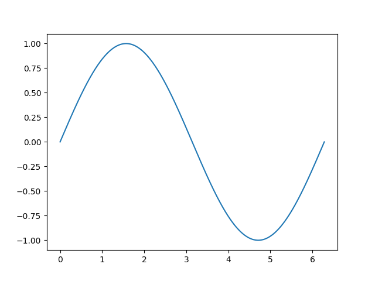

# pyplotを用いたグラフ作成
## はじめに
このリポジトリは、pyplot初学者を対象に、グラフの書き方を示すものです。
やっていることはpyplotを用いて簡単な三角関数をグラフ上にプロットし、デザインを整えていくというものです。一つ一つステップバイステップで作成していきます。
## 初めての関数のプロット
はじめにsin関数を作成します。ここではNumpyを用いて実装します。
```python
def sin(x):
  return np.sin(x)
```
次に、NumPyのlinspaceをもちいて、0~2Πまでの範囲を1000分割した空間を用意します。これはNumPyのlinspaceメソッドを用います。
```python
# Numpyの呼び出し
import numpy as np

# 0~2Πまでの空間の用意
fields = np.linspace(0, 2 * np.pi, 1000)
```
これで、使用するデータの準備は整いました。次に、pyplotをインポートしてグラフの設定を行います。
```python
import matplotlib.pyplot as plt

# グラフをプロット
plt.plot(fields, sin(fields), label="sin")
```
ここで、現時点でどのようなグラフが生成されるのか確認してみましょう。これまでのコードをまとめて実行します。
```python
import matplotlib.pyplot as plt
import numpy as np

def sin(x):
  return np.sin(x)

# Numpyの呼び出し
import numpy as np

# 0~2Πまでの空間の用意
fields = np.linspace(0, 2 * np.pi, 1000)

# グラフをプロット
plt.plot(fields, sin(fields), label="sin")

# グラフの表示
plt.show()
```

その結果、以下のような画像が生成されます。



まだまだ味気ないですね。もっと見やすくしてみましょう。
